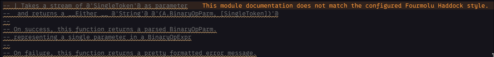
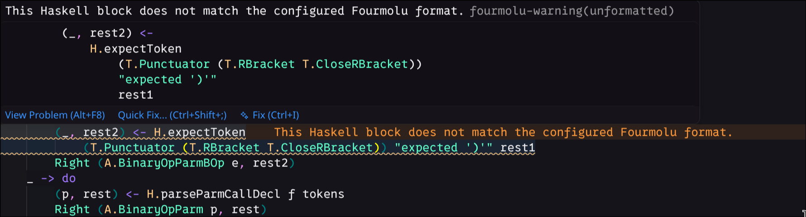

# Fourmolu Checker - Formatting Diagnostics for Haskell

Display Fourmolu formatting differences as VS Code diagnostics without automatically modifying your Haskell source files.

Unlike format-on-save, Fourmolu Checker reports when Fourmolu would change a saved file and lets you apply the formatting explicitly through a quick fix or command.

## Why use it?

Fourmolu Checker is useful when you want to:

* detect unformatted Haskell files without rewriting them on save;
* review formatting changes before applying them;
* surface formatting problems in the VS Code Problems panel;
* use the same Fourmolu executable and arguments as your project or CI;
* keep `editor.formatOnSave` disabled.

## Features

* checks saved `.hs` files, plus clean files when they are opened while automatic checking is enabled;
* reports each affected Fourmolu formatting block in the Problems panel;
* identifies reordered imports, Haddock documentation, extra spaces and extra blank lines when those are the only formatting change in a block;
* shows the corresponding formatted block when hovering a formatting diagnostic;
* provides a preferred quick fix to apply Fourmolu formatting;
* supports standalone files, simple workspaces and multi-root workspaces;
* provides configurable include and exclude globs;
* supports additional Fourmolu arguments and a custom executable path;
* distinguishes formatting differences from Fourmolu parser and execution errors;
* supports local, Remote SSH, WSL and devcontainer workspaces.

## Examples

### Import ordering



### Documentation formatting


### Generic formatting warning



## Requirements

Install `fourmolu` in the environment where the VS Code extension runs.

For Remote SSH, WSL and devcontainer workspaces, install Fourmolu in the remote environment rather than on the local machine.

By default, the extension runs `fourmolu` from the `PATH` of the VS Code extension host. Set `fourmoluChecker.executablePath` when the executable is located elsewhere.

## Executable and project resolution

`fourmoluChecker.executablePath` accepts an executable name, an absolute path, a workspace-relative path, or `${workspaceFolder}`. Relative paths and `${workspaceFolder}` are resolved from the workspace folder that owns the file. For a standalone file, they are resolved from that file's directory.

Fourmolu is started with argument arrays rather than a shell command, so file and executable paths containing spaces work normally. Its working directory is the owning workspace folder, or the standalone file's directory. This lets Fourmolu discover `fourmolu.yaml` and related project files itself; this extension does not parse Fourmolu configuration.

## Usage

Open a Haskell file and save it.

When Fourmolu would modify the file, the extension publishes diagnostics on the affected source blocks and in the VS Code Problems panel. Hover a diagnostic to see Fourmolu's formatted output for that block.

The extension does not modify the file automatically. Apply the formatting using the lightbulb quick fix or one of these commands:

* `Fourmolu Checker: Check Current File`
* `Fourmolu Checker: Format Current File`

## Settings

| Setting                          | Default           | Purpose                                                     |
| -------------------------------- | ----------------- | ----------------------------------------------------------- |
| `fourmoluChecker.enabled`        | `true`            | Enables Fourmolu diagnostics.                               |
| `fourmoluChecker.checkOnSave`    | `true`            | Checks on save and when a clean file is opened.             |
| `fourmoluChecker.diagnosticSeverity` | `"warning"`   | Formatting severity: `warning` or `information`.            |
| `fourmoluChecker.executablePath` | `"fourmolu"`      | Fourmolu executable name or path.                           |
| `fourmoluChecker.include`        | `["**/*.hs"]`     | Workspace-relative files to check.                          |
| `fourmoluChecker.exclude`        | Build directories | Workspace-relative files to ignore.                         |
| `fourmoluChecker.extraArguments` | `[]`              | Arguments passed before Fourmolu's mode and file arguments. |

### Additional Fourmolu options

```json
{
  "fourmoluChecker.include": [
    "services/**/*.hs",
    "libs/**/*.hs"
  ],
  "fourmoluChecker.extraArguments": [
    "-o", "-XImportQualifiedPost",
    "-o", "-XOverloadedRecordDot",
    "-o", "-XOverloadedLabels"
  ]
}
```

### Workspace-relative executable

Relative executable paths and `${workspaceFolder}` are resolved independently for each workspace folder:

```json
{
  "fourmoluChecker.executablePath": "tools/fourmolu"
}
```

### Diagnostic severity

Formatting diagnostics default to `warning`. Set `fourmoluChecker.diagnosticSeverity` to `information` for a less prominent Problems entry. Execution, parser and malformed-output failures remain errors.

## Output and troubleshooting

Use **View: Output** and select **Fourmolu Checker** to inspect failures. The channel records the file, selected workspace folder, resolved executable, working directory, argument array, exit status and stderr. It never logs formatted source output.

If VS Code reports that the executable was not found, verify that `fourmolu` is available from the extension host's `PATH` (for example, run `fourmolu --version` in the integrated terminal of that same environment), or configure `fourmoluChecker.executablePath` explicitly. If it is already installed, verify that the selected workspace directory is still available to the extension host. In Remote SSH, WSL and devcontainers, install/configure it in the remote environment rather than on the local machine.

## Development

The test suite uses Node.js built-ins and a fake Fourmolu process. It does not modify Haskell source files.

```bash
npm test
```

Launch an Extension Development Host with:

```bash
code --new-window --extensionDevelopmentPath="$PWD" /path/to/haskell-workspace
```
